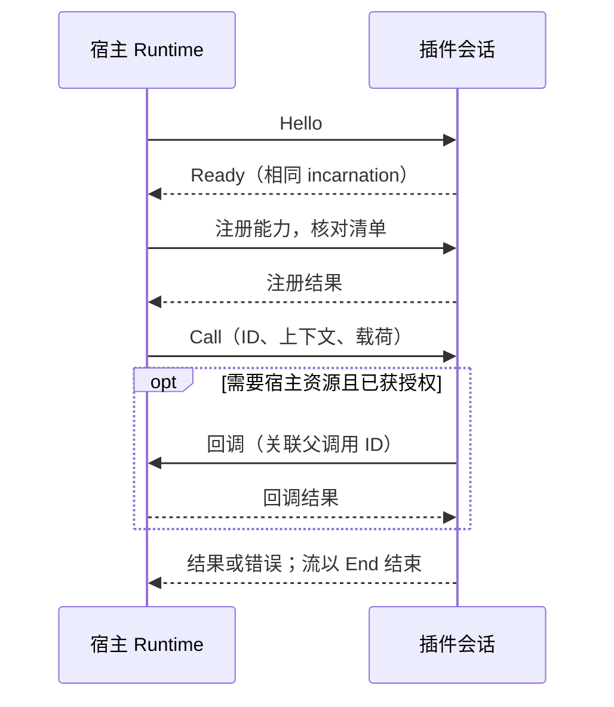

# Gateway Plugin SDK

用于编写 Codex Proxy 插件的 Rust 合同与可选会话辅助。插件只依赖本包，不依赖宿主 Core、Admin、Store 或 Host。
SDK 仍处于实验阶段；能力是否可用取决于宿主支持、清单声明、实际注册和安装时接受的访问域，
而不只是枚举中存在该名称。

| 版本 | 当前值 | 用途 |
| --- | --- | --- |
| SDK 包 | `0.4.0` | Rust 开发依赖，独立于网关版本 |
| `manifestVersion` | `3` | 安装清单格式 |
| `package.protocolVersion` | `4` | 宿主与插件的进程通信 |
| `contributes.*.version` | `1` | 单项能力合同 |

开发顺序：编写[清单](docs/manifest.md) → 实现[能力处理器](docs/capabilities.md) → 用 [CLI](../../../apps/plugin-cli/README.md)
打包 → [安装、配置与启用](../../../../docs/plugins.md)。完整可运行示例位于独立仓库
`codex-proxy-plugins` 的 `examples/workbench`。

使用 AI 协作开发时，可调用仓库技能 [`$plugin-dev`](../../../../.agents/skills/plugin-dev/SKILL.md)，按任务定位合同、示例和验证入口。

## 模块与依赖

| 入口 | 职责 |
| --- | --- |
| 根门面 | 清单、能力声明、调用上下文、消息与帧、公开错误 |
| `call::auth` | 凭据导入、导出、轮换、刷新和登录的数据合同 |
| `call::frontend_authentication` | 数据面认证信封、认证器标识与外部 principal 结果 |
| `call::provider` | 注册、模型、执行、计费；子模块 `account`、`quota`、`reset_credits` 提供账号资料、额度和重置卡合同 |
| `call::middleware` | 洋葱中间件请求/响应 head、single-use next 与惰性正文 frame 合同 |
| `call::policy` | 模型路由、账号调度及终态用量观察合同 |
| `call::observation` | 实际上游 WebSocket 响应帧的只读观察合同 |
| `call::host` | 账号、私有状态、受管 HTTP、模型、亲和、日志及调用内流的宿主回调合同 |
| `call::management` | 管理 API、页面与资源声明、公开回调，以及 CLI 命令与待保存账号 |
| `client` | 通过 `io` feature 开启的 `PluginBuilder`、会话、中间件与异步帧收发 |

`call/` 按业务能力组织数据，`message.rs` 定义消息与帧。请求／响应改写、协议转换和思考参数映射统一使用
`call::middleware`；WebSocket 观察接口不能改写连接。

插件使用的导入路径例如：

```rust
use gateway_plugin_sdk::{Frame, Message, PluginFault};
use gateway_plugin_sdk::call::{auth::LoginPollResult, provider::ExecutionEvent};
// 需要 Cargo 依赖声明启用 features = ["io"]。
use gateway_plugin_sdk::client::{read_frame, write_frame};
```

默认 feature 不引入异步运行时。`io` 除帧编解码外，还提供 `PluginBuilder`、
`PluginSession::accept/run` 和 `PluginHandler`。组合插件从作者清单建立类型化方法，SDK 自动生成
`plugin.register`；作者不需要复制贡献项或手写方法名、阶段和敏感载荷编解码。
会话管理握手、有界并发、父调用关联、回调、流信用、取消、排空与关闭。
`ResponseStream::channel` 提供有界流生产入口；`PluginCall` 的宿主客户端只代表当前父调用，
不能用另一调用的 ID 扩大权限。插件程序自行选择运行时和启动入口，不会启动网关。
`SessionConfig` 默认帧上限与宿主默认值一致，为 1 MiB；部署调整宿主帧上限时，插件应同步配置，
当前握手不自动协商该限制。流式分块还必须满足宿主实际授予的信用窗口。

## 通信边界

启用 `io` 时优先用 [`PluginBuilder`](docs/capabilities.md#类型化作者入口) 组合业务处理器，再交给
`PluginSession::run`。仅实现中间件时也可直接使用
[`MiddlewarePlugin`](docs/capabilities.md#洋葱中间件)。



### 帧与会话

每帧以两个大端 `u32` 分别声明 JSON 元数据和二进制载荷的长度，随后依次传输两部分。
调用方提供总长度上限；元数据另有 64 KiB 上限。读取在分配内存前校验长度，截断帧和
无效元数据返回 `FrameError`。这些函数不自动重试调用；部分读取或写入中断后，不应
把同一字节位置误当作新帧边界。
底层 `read_frame` / `write_frame` 不是取消安全的；自行编排会话时，不能在 `select!` 的其他分支完成后
重建半途中的帧读写。`PluginSession` 会在处理调用完成通知时保留同一个读取 future，直到完整帧到达或会话关闭。

会话由宿主发送 `Hello`，插件校验协议后返回携带相同 incarnation 的 `Ready`。
注册结果必须与清单中的能力一致。一次 `Call` 的结果、错误和流帧按 ID 关联；回调必须
携带当前父调用 ID。实例、代次、阶段、账号或资源 ID 是关联数据，不能自行充当授权。

## 本地验证

从仓库根目录执行：

```bash
RUST_MIN_STACK=16777216 cargo +1.97.0 test --manifest-path backend/Cargo.toml -p gateway-plugin-sdk --no-default-features --locked
RUST_MIN_STACK=16777216 cargo +1.97.0 test --manifest-path backend/Cargo.toml -p gateway-plugin-sdk --all-features --locked
RUST_MIN_STACK=16777216 RUSTDOCFLAGS='-D warnings' cargo +1.97.0 doc --manifest-path backend/Cargo.toml -p gateway-plugin-sdk --all-features --no-deps --locked
```

源码中的类型和字段是当前合同；宿主接入、目录边界与 Runtime 集成验证见
[系统架构](../../../../docs/architecture.md)。Provider 实现只依赖公开 SDK 合同，宿主不按插件 ID 特判。
单元测试与文档构建不代替目标平台上的安装、授权及实际能力验证。
